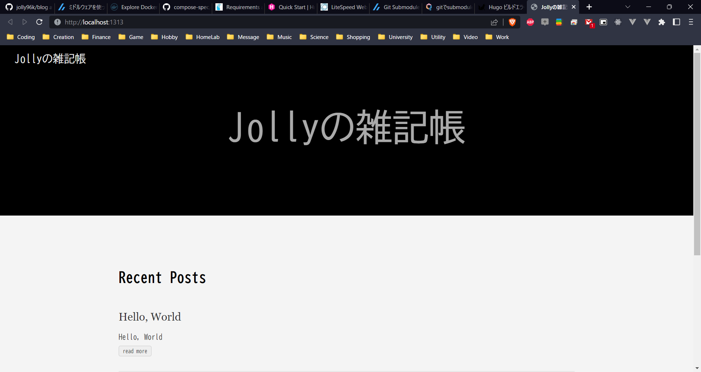

# blog

## ■このリポジトリについて
DockerでHugoの開発環境を構築するプロジェクト。

Hugoを触ってみたいけど、ホストの環境を汚すのは嫌だな…という方の一助になれば。

Hugo、Dockerについては公式情報を参照。

## ■ディレクトリ構造
    blog
    ├── dockerfile   ★Hugoの開発環境を構築するdockerfile
    ├── image
    │   └── hugo-blog.png
    ├── README.md
    ├── script   ★開発作業時に使うスクリプト
    │   ├── build_static_pages.sh
    │   ├── run_hugo_dev.sh
    │   └── run_hugo_server.sh
    └── volume
        └── hugo
            └── data
                └── hugo-blog   ★コンテナにマウントするHugoのプロジェクト
                    ├── archetypes
                    ├── config.toml
                    ├── content
                    ├── README.md
                    └── themes

## ■利用時の注意
### 前提条件
Dockerの実行環境がインストールされていること、DockerやDocker Composeの基本的な使い方を習得していることを前提としている。

### クローンするときの注意
Hugoのプロジェクトをサブモジュールで追加しているため、クローンするときは"--recurse-submodules"オプションを付ける必要あり。

    $ git clone https://github.com/jolly96k/blog.git --recurse-submodules  --remote-submodules

## ■チュートリアル
### 1. Hugoの開発環境をビルド
    $ docker build -t hugo .
    $ docker image ls
    REPOSITORY              TAG       IMAGE ID       CREATED        SIZE
    hugo                    latest    75e089614635   37 hours ago   256MB   ★Hugoの開発環境
    ubuntu                  22.04     cdb68b455a14   10 days ago    77.8MB

Dockerのコンテナイメージがビルドできていれば成功。

イメージの名前は任意で良いが、後述するスクリプトは"hugo"を前提としている...🙇‍♂️🙇‍♂️🙇‍♂️

### 2. Hugoの開発用サーバーを起動
    $ bash script/run_hugo_server.sh
    Start building sites …
    hugo v0.105.0-0e3b42b4a9bdeb4d866210819fc6ddcf51582ffa linux/amd64 BuildDate=2022-10-28T12:29:05Z VendorInfo=gohugoio
    INFO 2022/11/04 07:05:19 syncing static files to /

                    | EN
    -------------------+-----
    Pages            | 10
    Paginator pages  |  0
    Non-page files   |  0
    Static files     |  1
    Processed images |  0
    Aliases          |  1
    Sitemaps         |  1
    Cleaned          |  0

    Built in 23 ms
    Watching for changes in /home/penguin/hugo_ws/hugo-blog/{archetypes,content,data,layouts,static,themes}Watching for config changes in /home/penguin/hugo_ws/hugo-blog/config.toml, /home/penguin/hugo_ws/hugo-blog/themes/ananke/config.yaml
    Environment: "development"
    Serving pages from memory
    Running in Fast Render Mode. For full rebuilds on change: hugo server --disableFastRender
    Web Server is available at http://localhost:1313/ (bind address 0.0.0.0)
    Press Ctrl+C to stop

Dockerコンテナが動作するホストの1313番ポートにアクセスすると、静的サイトが表示される。

### 3. その他
Hugoの開発環境を起動してコマンド操作したいときは、run_hugo_dev.shを呼び出してコンテナ内部で作業を行うことができる。

    $ bash script/run_hugo_dev.sh

    penguin@41950ee36142:~$ pwd
    /home/penguin

    penguin@41950ee36142:~$ ls -lh
    total 4.0K
    drwxrwxr-x 3 penguin penguin 4.0K Nov  4 06:50 hugo_ws

    penguin@41950ee36142:~$ cd hugo_ws
    penguin@41950ee36142:~/hugo_ws$ ls -lh
    total 4.0K
    drwxrwxr-x 10 penguin penguin 4.0K Nov  4 07:05 hugo-blog

## ■参考URL
Hugo公式サイト: <https://gohugo.io/>

Hugoクイックスタート: <https://gohugo.io/getting-started/quick-start/>

Docker公式サイト: <https://www.docker.com/>

Docker公式Docs: <https://docs.docker.com/>